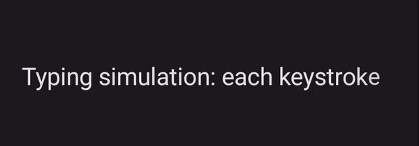

# Torph for Jetpack Compose

An unofficial port of [torph](https://github.com/lochie/torph) to Jetpack Compose: text that
morphs between values. Characters shared between the old and new string glide to their new
position, new ones fade in, removed ones fade out, and digits roll vertically by place value.

> **This is a personal project.** It is not a Google product, and it is not affiliated with,
> endorsed by, or supported by Google or the Jetpack Compose team. It is also not affiliated with
> or endorsed by the [torph](https://github.com/lochie/torph) project. See
> [License and attribution](#license-and-attribution).

```kotlin
TextMorph(text = "$1,234.50")          // change the string, get a morph
TextMorph(value = 1234.5, decimals = 2) // or hand it a number
```

| Numbers roll by place value | Shared letters glide into place |
| :---: | :---: |
|  |  |
| **Updates faster than the roll keep rolling** | **Rapid updates never snap** |
|  |  |

Recorded from the `:demo` app on a Pixel 10 Pro.

## Modules

| Module | What | Depends on |
| --- | --- | --- |
| `:torph-core` | Pure Kotlin/JVM: segmentation, place-value number matching, diff, spring math. Unit-tested. | nothing |
| `:torph-compose` | Android library: `TextMorph`, `rememberTextMorphState`, `Modifier.textMorph`, easing helpers. | core, Compose foundation/animation/ui-text |
| `:demo` | Material 3 app mirroring torph.lochie.me: Playground, Numbers, Typing, Multi-line, Scripts, Interruption, Debug, Perf. | compose, Material 3 |

## API

```kotlin
@Composable
fun TextMorph(
    text: String,
    modifier: Modifier = Modifier,
    style: TextStyle = TextStyle.Default,
    color: Color = Color.Unspecified,
    ease: MorphEase = MorphEase.Curve(MorphEasings.Default),   // cubic-bezier(0.19, 1, 0.22, 1)
    duration: Duration = 400.milliseconds,                     // ignored for MorphEase.Spring
    scale: Boolean = true,            // scale entering/exiting segments 0.5 <-> 1
    numbers: Boolean = true,          // place-value matching + vertical roll
    locale: Locale = Locale.current,  // grapheme/word boundaries and number symbols
    cursorIndex: Int? = null,         // caret matching for editable fields
    segmentation: Segmentation = Segmentation.AUTO,  // GRAPHEME | WORD | AUTO
    sizeMode: MorphSizeMode = MorphSizeMode.Animate, // or Snap for fixed slots
    disabled: Boolean = false,
    respectReducedMotion: Boolean = true,
    debug: Boolean = false,           // draw segment rects, ids, enter/exit colours
    onAnimationStart: (() -> Unit)? = null,
    onAnimationComplete: (() -> Unit)? = null,
    onAnimationCancel: (() -> Unit)? = null,
    state: TextMorphState = rememberTextMorphState(),
)

sealed interface MorphEase {
    data class Curve(val easing: Easing) : MorphEase
    data class Spring(stiffness = 100f, damping = 10f, mass = 1f, precision = 0.001f) : MorphEase
}

cssCubicBezier("cubic-bezier(0.19, 1, 0.22, 1)") // port torph configs verbatim
```

Lower level: `rememberTextMorphState()` + `Modifier.textMorph(state)` for custom containers, and
`segmentText` / `diffSegments` / `findNumericWords` / `settleTime` from `des.c5inco.torph.core`.

## How it works

Per text change (never per frame):

1. The full target string is measured once with `TextMeasurer` under the incoming constraints, so
   line breaks and kerning match a real `Text`.
2. `diffSegments` pairs numeric words by order and matches digits by place value; everything else
   goes through a left-biased LCS on grapheme (or word) text.
3. Each segment gets a target rect from the layout's bounding boxes and a cached single-segment
   `TextLayoutResult`.
4. Animatables are retargeted: persist → `offset.animateTo`, enter → alpha/scale in (a digit that changed at the same place
   becomes an odometer strip from old to new digit), exit → alpha/scale out then removed from the list by the animation coroutine.
5. The container size animates (or snaps) to the new layout size.

Per frame: one `drawText(cachedLayout, topLeft, alpha)` per live segment inside a `Canvas`-style
`drawBehind`. Animatables are read only in the layout and draw phases, never in composition, and
the traces confirm composition does not run per frame. Note that a *layout* pass does run per frame
while the container size animates; use `sizeMode = Snap` to skip it.

Complex scripts: `Segmentation.AUTO` detects Arabic, Hebrew, Indic, Thai, Lao, Khmer, Myanmar,
Tibetan and Mongolian words via `Character.UnicodeScript` and morphs them as whole words so
contextual shaping survives. Above 300 segments any mode falls back to `WORD`.

## Building

```bash
./gradlew :torph-core:test :demo:installDebug
```

Instrumentation tests for the Compose layer: `./gradlew :torph-compose:connectedDebugAndroidTest`
with an emulator running. That suite includes `DrawAllocationTest`, a regression guard that fails
if the draw path starts allocating per frame. See [docs/BENCHMARKS.md](docs/BENCHMARKS.md).

## Benchmarks

`:benchmark` is a Macrobenchmark module covering long text, number rolling, rapid interruption, and
multi-line reflow:

```bash
./gradlew :benchmark:connectedBenchmarkAndroidTest
```

Results, the phase-by-phase breakdown of where a text change spends its time, and notes on running
against a physical device are in [docs/BENCHMARKS.md](docs/BENCHMARKS.md).

Implementation status and known gaps are tracked in [docs/STATUS.md](docs/STATUS.md).

## License and attribution

Torph for Jetpack Compose is MIT licensed. See [LICENSE](LICENSE).

This is an **independent, unofficial port** of [torph](https://github.com/lochie/torph) by
[Lochie Axon](https://github.com/lochie), used under the MIT License. The Kotlin here was written
from scratch, but the API surface, option names, algorithms, and default values follow torph's so
that configurations carry over directly. Upstream's full copyright notice is in [NOTICE](NOTICE).

If you want the original, go use it: <https://torph.lochie.me>.

### Not affiliated with Google

This is a personal project by [Chris Sinco](https://github.com/c5inco). It is not a Google
product and is not endorsed or supported by Google. "Android" and "Jetpack Compose" are trademarks
of Google LLC, used here only to describe what this library targets.
