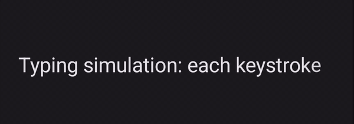

# Torph for Jetpack Compose

An unofficial port of [torph](https://github.com/lochie/torph) to Jetpack Compose: text that
morphs between values. Characters shared between the old and new string glide to their new
position, new ones fade in, removed ones fade out, and digits roll vertically by place value.

> **This is a personal project.** It is not a Google product, and it is not affiliated with,
> endorsed by, or supported by Google or the Jetpack Compose team. It is also not affiliated with
> or endorsed by the [torph](https://github.com/lochie/torph) project. See
> [License and attribution](#license-and-attribution).

```kotlin
TextMorph(text = "$1,234.50")          // change the string, get a morph
TextMorph(value = 1234.5, decimals = 2) // or hand it a number
```

| Numbers roll by place value | Shared letters glide into place |
| :---: | :---: |
|  |  |
| **Updates faster than the roll keep rolling** | **Rapid updates never snap** |
|  |  |

Recorded from the `:demo` app on a Pixel 10 Pro.

## Use it in your project

There is no Maven Central release yet, so you build the library from this repo and resolve it from
your local Maven repository:

```bash
git clone https://github.com/c5inco/torph-compose.git
cd torph-compose
./gradlew publishLocal    # installs both libraries into ~/.m2/repository
```

That needs a JDK and an Android SDK with platform 36; see
[Building from source](#building-from-source). Then, in the project that wants to use it:

```kotlin
// settings.gradle.kts
dependencyResolutionManagement {
    repositories {
        mavenLocal()
        google()
        mavenCentral()
    }
}
```

```kotlin
// app/build.gradle.kts
implementation("des.c5inco:torph-compose:0.1.0")  // Compose UI, brings :torph-core with it
```

`./gradlew torphCoordinates` prints that dependency line for the version you have checked out, and
`publishLocal` takes `-PVERSION_NAME=0.2.0-SNAPSHOT` if you want to stamp a different one.

### What your project needs

- `minSdk` 24 or higher, and `compileSdk` 36 or higher.
- Java 17 bytecode (`compileOptions` / `jvmToolchain(17)`).
- Compose: the library is built against Compose BOM 2026.01.01 and only depends on
  foundation/animation/ui/ui-text, not Material.

Then:

```kotlin
import des.c5inco.torph.compose.TextMorph

TextMorph(text = "$1,234.50")
```

`:torph-core` is plain Kotlin/JVM (`des.c5inco:torph-core`) if you only want the segmentation and
diff algorithms without Compose.

## Modules

| Module | What | Depends on |
| --- | --- | --- |
| `:torph-core` | Pure Kotlin/JVM: segmentation, place-value number matching, diff, spring math. Unit-tested. | nothing |
| `:torph-compose` | Android library: `TextMorph`, `rememberTextMorphState`, `Modifier.textMorph`, easing helpers. | core, Compose foundation/animation/ui-text |
| `:demo` | Material 3 app mirroring torph.lochie.me: Playground, Numbers, Typing, Multi-line, Scripts, Interruption, Debug, Perf. | compose, Material 3 |

## API

```kotlin
@Composable
fun TextMorph(
    text: String,
    modifier: Modifier = Modifier,
    style: TextStyle = TextStyle.Default,
    color: Color = Color.Unspecified,
    ease: MorphEase = MorphEase.Curve(MorphEasings.Default),   // cubic-bezier(0.19, 1, 0.22, 1)
    duration: Duration = 400.milliseconds,                     // ignored for MorphEase.Spring
    scale: Boolean = true,            // scale entering/exiting segments 0.5 <-> 1
    numbers: Boolean = true,          // place-value matching + vertical roll
    locale: Locale = Locale.current,  // grapheme/word boundaries and number symbols
    cursorIndex: Int? = null,         // caret matching for editable fields
    segmentation: Segmentation = Segmentation.AUTO,  // GRAPHEME | WORD | AUTO
    sizeMode: MorphSizeMode = MorphSizeMode.Animate, // or Snap for fixed slots
    disabled: Boolean = false,
    respectReducedMotion: Boolean = true,
    debug: Boolean = false,           // draw segment rects, ids, enter/exit colours
    onAnimationStart: (() -> Unit)? = null,
    onAnimationComplete: (() -> Unit)? = null,
    onAnimationCancel: (() -> Unit)? = null,
    state: TextMorphState = rememberTextMorphState(),
)

sealed interface MorphEase {
    data class Curve(val easing: Easing) : MorphEase
    data class Spring(stiffness = 100f, damping = 10f, mass = 1f) : MorphEase
}

cssCubicBezier("cubic-bezier(0.19, 1, 0.22, 1)") // any CSS cubic-bezier or keyword easing, as written
```

Lower level: `rememberTextMorphState()` + `Modifier.textMorph(state)` for custom containers, and
`segmentText` / `diffSegments` / `findNumericWords` from `des.c5inco.torph.core`.

### Coming from torph

This library follows torph's behavior, option names and defaults where they make sense on Compose,
so it should feel familiar. It is not a drop-in equivalent, though: there is no way to load a torph
setup, so you translate it to Kotlin yourself, and some options differ because the platforms do.

Same name, meaning and default as torph: `scale`, `numbers`, `debug`, `disabled`,
`respectReducedMotion`, `cursorIndex`, `onAnimationStart`,
`onAnimationComplete` and `onAnimationCancel` (exactly one of complete or cancel per morph).

Where it differs, and why:

| torph | here | why |
| --- | --- | --- |
| A component per framework, plus `MorphController` with `update()` | The `TextMorph` composable, or `rememberTextMorphState()` with `Modifier.textMorph(state)` for custom containers | Compose has composables and modifiers instead of components and DOM controllers. |
| `text` / `children`: a string or a number | Two overloads: `text: String` and `value: Number` | Kotlin overloads instead of a union type. |
| `decimals`: unset by default, so a number shows the locale's default fraction digits (up to 3) | `decimals` on the `value: Number` overload, default `0` | Formatting goes through `java.text.NumberFormat`. Pass `decimals` explicitly to control fraction digits on both. |
| `duration`: milliseconds as a number | `duration: Duration`, default `400.milliseconds` | Kotlin's typed duration. |
| `ease`: a CSS easing string or spring params | `ease: MorphEase`, either `Curve(Easing)` or `Spring(stiffness, damping, mass)`; `cssCubicBezier("…")` turns a CSS cubic-bezier or keyword easing into an `Easing` | Compose animates with typed `Easing`s, not CSS strings. |
| Spring `precision` | No equivalent | torph bakes a spring into a fixed-length CSS `linear()` curve and uses `precision` to decide where to cut it off. Here the spring runs live, keeps its velocity when a new value interrupts it, and stops once movement is under half a pixel. The same spring can therefore finish at a slightly different time than in torph. |
| `locale`: `Intl.LocalesArgument`, default `"en"` | `locale: Locale` (Compose), default `Locale.current` | Compose's locale type; following the device locale is the Android convention. |
| Splits text into words whenever it contains a space or newline, and into characters only for a single word | `segmentation`, default `AUTO`: characters within each word, whole words for scripts that need contextual shaping (Arabic, Indic, Thai and others), and words for any text over 300 segments | Use `Segmentation.WORD` to get torph's word-by-word morph for text with spaces. |
| `className`, `style`, `as` | `modifier`, `style: TextStyle`, `color` | Compose styling. |
| Container size always animates | `sizeMode`: `Animate` (default) or `Snap` | `Snap` skips the per-frame layout pass while the size animates, for fixed-size slots like counters. |
| `segmentText`, `diffSegments`, number helpers | `segmentText`, `diffSegments`, `findNumericWords` in `torph-core` | Same names and purpose, but Kotlin signatures: segmenter, options and id arguments differ. |

## How it works

Per text change (never per frame):

1. The full target string is measured once with `TextMeasurer` under the incoming constraints, so
   line breaks and kerning match a real `Text`.
2. `diffSegments` pairs numeric words by order and matches digits by place value; everything else
   goes through a left-biased LCS on grapheme (or word) text.
3. Each segment gets a target rect from the layout's bounding boxes and a cached single-segment
   `TextLayoutResult`. Boxes for leading lines an edit leaves unchanged are kept from the previous
   layout.
4. Each segment's position, alpha and scale are plain float channels, retargeted from their current
   value and velocity: persist → move to the new position, enter → alpha/scale in (a digit that
   changed at the same place becomes an odometer strip from old to new digit), exit → alpha/scale
   out, then dropped by the frame loop once settled.
5. The container size animates (or snaps) to the new layout size.

Per frame: one frame loop advances every channel, and one `drawText(cachedLayout, topLeft, alpha)`
per live segment runs inside a `drawBehind` in its own graphics layer, so siblings redrawing do not
re-record the text. Channels are read only in the layout and draw phases, never in composition, and
the traces confirm composition does not run per frame. Note that a *layout* pass does run per frame
while the container size animates; use `sizeMode = Snap` to skip it.

Complex scripts: `Segmentation.AUTO` detects Arabic, Hebrew, Indic, Thai, Lao, Khmer, Myanmar,
Tibetan and Mongolian words via `Character.UnicodeScript` and morphs them as whole words so
contextual shaping survives. Above 300 segments any mode falls back to `WORD`.

## Building from source

You need a JDK to run Gradle (any recent one; the build uses a Java 17 toolchain and downloads it
if your machine does not have one) and, for everything except `:torph-core`, an Android SDK with
platform 36 installed. Point at it with `ANDROID_HOME` or a `local.properties` containing
`sdk.dir=/path/to/Android/sdk`.

| Command | What it does |
| --- | --- |
| `./gradlew torphCoordinates` | Print the coordinates this checkout publishes. |
| `./gradlew publishLocal` | Build both libraries into `~/.m2/repository`. |
| `./gradlew :torph-core:test` | Core unit tests. Pure JVM, no device or SDK. |
| `./gradlew :torph-compose:assembleRelease` | Build the Android library AAR only. |
| `./gradlew :demo:installDebug` | Install the demo app on a connected device or emulator. |
| `./gradlew :torph-compose:connectedDebugAndroidTest` | Compose instrumentation tests (device needed). |
| `./gradlew :benchmark:connectedBenchmarkAndroidTest` | Macrobenchmarks (device needed). |

The instrumentation suite includes `DrawAllocationTest`, a regression guard that fails if the draw
path starts allocating per frame. See [docs/BENCHMARKS.md](docs/BENCHMARKS.md).

## Benchmarks

`:benchmark` is a Macrobenchmark module covering long text, number rolling, rapid interruption, and
multi-line reflow (`./gradlew :benchmark:connectedBenchmarkAndroidTest`). Results, the
phase-by-phase breakdown of where a text change spends its time, and notes on running against a
physical device are in [docs/BENCHMARKS.md](docs/BENCHMARKS.md).

Implementation status and known gaps are tracked in [docs/STATUS.md](docs/STATUS.md).

## License and attribution

Torph for Jetpack Compose is MIT licensed. See [LICENSE](LICENSE).

This is an **independent, unofficial port** of [torph](https://github.com/lochie/torph) by
[Lochie Axon](https://github.com/lochie), used under the MIT License. The Kotlin here was written
from scratch. Its API, option names, algorithms and defaults follow torph's where that makes sense
on Compose, so it will feel familiar, but it is not a drop-in equivalent: you translate a torph setup
yourself, and the two differ where the platforms do. Upstream's full copyright notice is in [NOTICE](NOTICE).

If you want the original, go use it: <https://torph.lochie.me>.

### Not affiliated with Google

This is a personal project by [Chris Sinco](https://github.com/c5inco). It is not a Google
product and is not endorsed or supported by Google. "Android" and "Jetpack Compose" are trademarks
of Google LLC, used here only to describe what this library targets.
